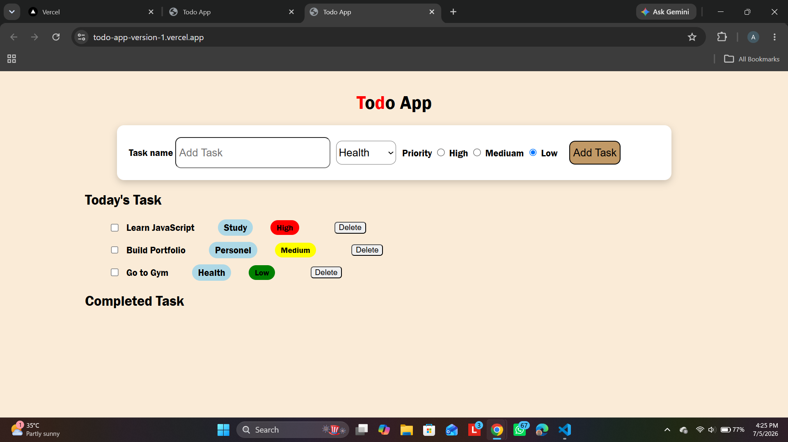

# Todo App version 1.0
A modern Todo application built using HTML, CSS, and JavaScript. It helps users manage daily tasks with categories, priorities, and task completion features.

## Features.
- Add new tasks.
- Delete task.
- Mark task as completed.
- Organize task using categories.
- Set priority ( High, medium , low).
- Prevent duplicate tasks.
- Clean and responsive user interface.

##  Tech Stack

- HTML5
- CSS3
- JavaScript (ES6)
- Git
- GitHub
- Vercel

##  Live Demo

🔗https://todo-app-version-1.vercel.app/

##  Source Code

GitHub Repository:
https://github.com/Aditya312006/Todo-app-version-1

## 📸 Project Screenshot

